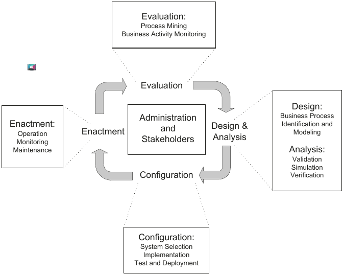
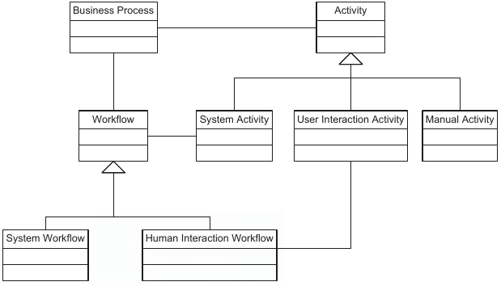
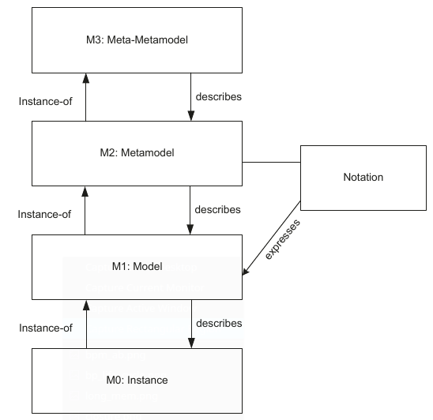
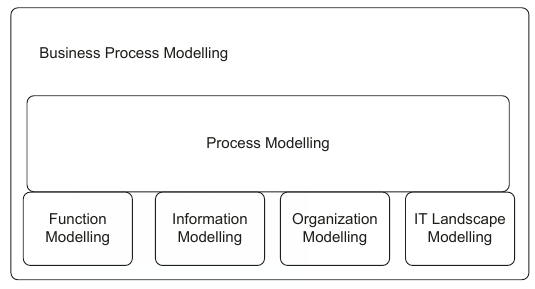
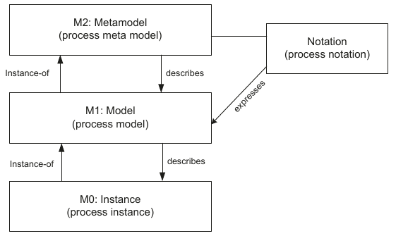
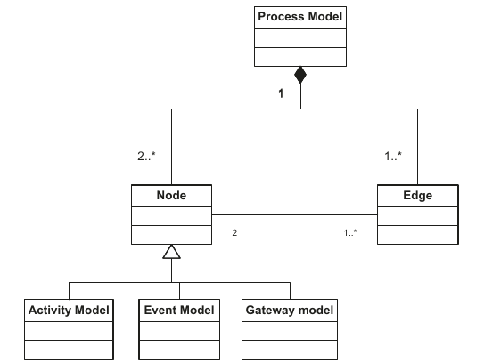
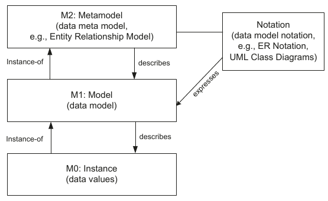
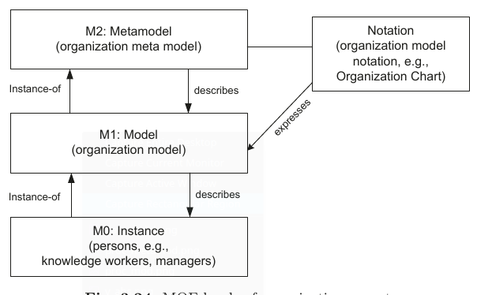
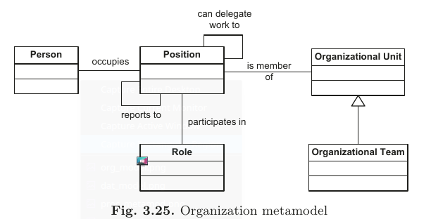

# Business processes
Business process management is based on the observation that each product
that a company provides to the market is the outcome of a number of activities performed. Business processes are the key instrument to organizing these
activities and to improving the understanding of their interrelationships.

While at an organizational level, business processes are essential to understanding how companies operate, business processes also play an important
role in the design and realization of flexible information systems. These information systems provide the technical basis for the rapid creation of new
functionality that realizes new products and for adapting existing functionality to cater to new market requirements.

Business process management  in the 90s with Business Process Re-engineering (Hammer, Champy) where a new way of organizing  companies on the basis of business processes was proposed. 
They define a business process as a collection of activities that take one or more kinds of input and create an output that is of value to the
customer.
This definition underline the importance of input (_precondition_) and output (_postcondition_). 

## Definitions
### Business process
> Consists of a set of activities that are performed in coordination in an organizational and technical environment. These activities jointly realize a business goal. Each business process is enacted by a single organization, but it may interact with business processes performed by other organizations.

#### ISO9000
>A  Process  is  a  set  of  interrelated  or interacting  activities,  which  transforms inputs into outputs.

### Business Process Management
> Business  process  management  includes concepts,  methods,  and  techniques  to support   the   design,   administration, configuration, enactment, and analysis of business processes.

The basis of business process management is the explicit representation of business processes with their activities and the execution constraints between them. Once business processes are defined, they can be subject to analysis, improvement, and enactment.

### Business Process Management System
>Is a generic software system that is driven by explicit process representations to coordinate the enactment of business processes.
 
### Business Process Model
> A business process model consists of a set of activity models and execution constraints between them. A _business process instance_ represents a concrete case in the operational business of a company, consisting of activity instances. 

Each business process model acts as a blueprint for a set
of business process instances, and each activity model acts as a blueprint for a set of activity instances.

## Business Process Lifecycle

Business process lifecycle consists of phases
that are related to each other. The phases are organized in a cyclical structure, showing their logical dependencies. These dependencies do not imply a strict temporal ordering in which the phases need to be executed.

### Design and Analysis
The business process lifecycle is entered in the Design and Analysis phase, in
which surveys on the business processes and their organizational and technical
environment are conducted. Based on these surveys, business processes are
identified, reviewed, validated, and represented by business process models.

Business process modelling techniques as well as validation, simulation,
and verification techniques are used during this phase. Business process modelling is the core technical subphase during process design.

### Configuration
Once the business process model is designed and verified, the business process needs to be implemented. It can be implemented by a set of policies and procedures that employees need to comply with. In this case the implementation is done without any support of business process managment system.

Otherwise, an implementation platform is chosen during the configuration phase.
The system needs to be configured according to the organizational environment of the enterprise and the business processes whose enactment it should control. This configuration includes the interactions of the employees with the system as well as the integration of the existing software systems with the business process management system.

Once the system is configured, the implementation of the business process needs to be tested (using traditional testing techniques). Once the test subphase is complete, the system is deployed in its target environment.

### Enactment
Business process instances are initiated to fulfill the
business goals of a company. Initiation of a process instance typically follows a defined event. 
 Process enactment needs to cater to a correct process orchestration, guaranteeing that
the process activities are performed according to the execution constraints specified in the process model.

Process monitoring is an important mechanism for providing accurate information on the status of business
process instances. This information is valuable, for instance, to respond to a
customer request that inquires about the current status of his case.

### Evaluation
The evaluation phase uses information available to evaluate and improve business process models and their implementations.

### Administration and Stakeholders

## Process Choreography
The interactions of a set of business processes are specified in a process
choreography. The term choreography indicates the absence of a central agent that controls the activities in the business processes involved. 
 

## Business Process Modelling Foundation

Business processes consist of activities whose coordinated execution realizes some business goal. These activities can be system activities, user interaction activities, or manual activities. Manual activities are not supported by
information systems. 

Certain parts of a business process can be enacted by workflow technology.
A **workflow management system** can make sure that the activities of a business
process are performed in the order specified, and that the information systems
are invoked to realize the business functionality. This relationship between
business processes and workflows is represented by an association between
the respective classes. 

With regard to the types of activities mentioned, system activities are associated with workflows, since system activities can participate in any kind of workflow, system workflow or human interaction workflow.

### Abstraction
To capture the complexity in business process management, different abstraction concepts are introduced. A traditional abstraction concept in computer science is the separation of modelling levels, called **horizontal abstraction**.

Another type of abstraction is made base on the necessity to investigate separated subdomains. In order to investigate them separately (*divide-et-impera*) they need to be represented separately. This approach is called **vertical abstraction**

#### Horizontal Abstraction

* **M0**: the instance level reflects the concrete entities that are involved in business processes. Executed activities, concrete data values, and resources and persons are represented at the instance level.

* **M1**: set of similar entities at the instance level are identified and classified at the model level. Models are expressed in metamodels that are associated with _notations_, often of a graphical nature. 

* **M2**: the complete set of concepts and associations between concepts is called metamodel. A metamodel becomes useful if there is a notation for this metamodel that allows expressing models in a convenient way

#### Vertical Abstraction
In the vertical abstraction distinct modelling subdomains are identified. Process modelling integrates the
modelling efforts that are conducted in the other subdomains.

Process modelling defines the glue between the subdomains, it relates functions of a business process with execution constraints.

Data aspects are covered because particular process instances
may depend on the structure and value of data involved in a particular business process. Data dependencies between activities need to be taken into account in process model design.

##### Function modelling
The functional model investigates the units of work that are being enacted
in the context of business processes.

##### Information modelling
Proper representation of data in business processes
is important, because decisions made during a business process depend on
particular data values.
Data dependencies between activities need to be
taken into account in order to avoid situations in which a function
requires certain data not available at that time.

##### Organization modelling
Activities in the business process can then be
associated with particular roles or departments in the organization.

##### IT Landscape modelling
Activities in a business process are performed by or with the assistance of information systems. The operational information technology landscape, that is, the information systems, their relationships, and their programming interfaces, needs to be represented to use the functionality provided by the
information systems.

#### Process Models

In the M0 layer there are process instances that reflect the actual
occurrences of a business process. Each process instance is an instance of a process model in the model layer M1. Process models are described by process metamodels, building the M2 layer.
In order to express process models, there needs to be a notation in place that provides notational elements for the conceptual elements of process metamodels.

##### Process metamodel

In metamodelling, the concepts to be represented are models.

* **Process Model**:  represents a blue print for a set of process instances with a similar structure. Process models have a two-level hierarchy, so that each process model consists of a set of activity models. Each process model consists of nodes and directed edges.

* **Edge**: express the relationships between nodes
in a process model.

* **Node**: can represent an activity model, an event
model, or a gateway model.
    * **Activity Model**: describes units of work conducted in a
business process. Each activity model can appear at most once in a process model. No activity model can appear in multiple process models.

    * **Event Model**:  Event models capture the occurrence of states relevant for a business process. Process instances start and end with events, so process models start and end with event models.

    * **Gateway Model**:  Gateways are used to express control flow constructs.

Each node is associated with at least one edge. The different types of nodes
are represented by the generalization relation. Activity models reflect the work
units to be performed, event models represent the occurrence of states relevant
for the business process, and gateway models represent execution constraints
of activities, such as split and join nodes.

#### Modeling Data
Business processes operate on data. Explicitly representing data, data types,
and data dependencies between activities of a business process puts a business
process management system in a position to control the transfer of relevant
data as generated and processed during processes enactment.

Data modelling is at the core of database design. The Entity Relationship
approach is used to classify and organize data in a given application domain.

#### Modeling Organization
An important task of a business process management system is the coordination of work among the personnel of an enterprise. To fulfill this, the system
has to be provided with information on the organizational structures.

The metamodel level
provides the means to express models, in this case organizational models. Concepts at this level are positions, roles, teams, and relationships between positions like supervisor. 
The general principle behind organization modelling is the resource,an entity that can perform work for the enterprise. The general concept of resource subsumes humans and other resources.

