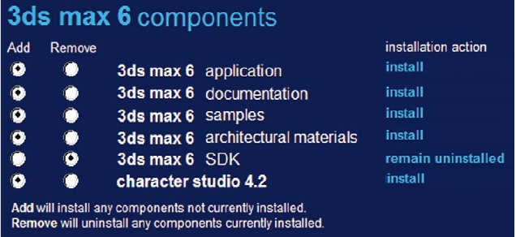
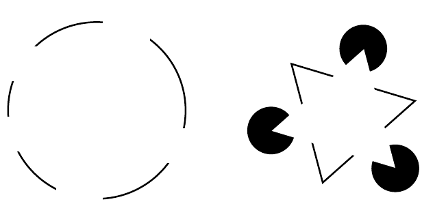

# Model Human Processor
The human being is one of the the main foundation of HCI. In fact, computer systems are the designed to meet the needs of the human being, so it's important to consider capabilities and limitation of the user.

Human being is a complex system so in HCI we represent it using a simplified _model_. 

In 1983, Card, Moran and Newell described the Model Human Processor,
which is a simplified view of the human processing involved in interacting with
computer systems. The model comprises three subsystems: t**he perceptual system**,
handling sensory stimulus from the outside world, the **motor system**, which controls
actions, and the **cognitive system**, which provides the processing needed to connect
the two.

<!-- The model also includes a number of *principles of operation* which dictate the behavior of the systems under certain conditions. -->

The are three components of this system: 
1. input–output
2. memory 
3. processing

## Input-output
A person interaction with the outside world  occurs through information being
received and sent: input and output. 
In an interaction with a computer the user receive information by the machine (which is the computer output) and responds providing input to the computer.

We use our senses to perceive information of the world and of ourselves. 
* Vision
* Hearing
* Touch 
* Taste
* Smell
* Proprioception or kinestesia: perception of the position of the body and its part in the space.
* Balance

### Vision 
Most important sense. The visual perception can be split in two stages:
* physical reception of the stimulus from the outside world;
* perception and iterpretation of the stimulus. 

The human eye is formed by the **cornea** and **lens** at the front of the eye focus the light into
a sharp image on the back of the eye, the **retina**. The retina is light sensitive and contains two types of photoreceptor: **rods** and **cones**.

There are fourtypes of photoreceptors:
* Rods(bastoncelli), spread allover the retina, verysensitive to the quantity of light and allowa fairly good night vision. They are not sensitive to colors and are easy to saturate (glare–abbagliamento).
* Cones(coni) are mainly placed in the fovea, and are very sensitive to the colors. They are not activate when the quantity of light is low, hence we have a limited perception of colors at night
* X-Ganglion: mostly in the fovea, are dedicated to the pre-identification of visual patterns
* W-and Y-Ganglion: are everywhere and more densely in the external part of the retina, and are dedicated  to the pre-identificationof movement. This allows to perceive movement at the back of the eye much faster even without recognizing the shapes. 

#### Vision and structure
The human vision is holistic.
Our visual system automatically imposes structure on visual input and is wired to
perceive whole shapes, figures, and objects rather than disconnected edges, lines,
and areas.
These theories
became known as the **Gestalt principles of visual perception**.

**Gestalt principles: Proximity**

The relative distance between objects affects our perception of whether and how the objects are organized into sub-groups. 

*In the image above, the stars are perceive grouped in row and columns*

According to this principle, items can be gruouped by simply reducing the space between them without any visual separation element, which can increase visual clutter. 

*Here poorly spaced radiobuttons look grouped in vertical columns.*

**Gestalt principles: Similarity**

Objects that look similar appear grouped.
<!-- ---------------- -->

**Gestalt principles: Continuity**

Several Gestalt principles describe our visual system’s tendency to resolve ambiguity or fill in missing data in such a way as to perceive whole objects. Coninuity states that our visual perception is biased to perceive continuous forms rather than disconnected ones *(Example: IBM logo)*.

**Gestalt principles: Closure**

This princible is also related to _Continuity_. In fact, clouser states that human visual system automatically closes open figures so that they are perceived as a whole. 

 

 This principles applies to GUIs. For example stacks of objects in a icon make users perceive those stacks as a whole object.

**Gestalt principles: Symmetry**

A third fact about our tendency to see objects is captured in the Gestalt principle of
Symmetry. It states that we tend to parse complex scenes in a way that reduces the
complexity. Our vision automatically organizes and interprets the data so as to simplify it and give it symmetry.

**Gestalt principles: Figure/Ground**

The next Gestalt principle that describes how our visual system structures the data
it receives is Figure/Ground. This principle states that our mind separates the visual
field into the figure (the foreground) and ground (the background). The foreground consists of those elements of a scene that are the object of our primary attention, and
the background is everything else.

**Gestalt principles: Common Fate**

The last principle is the Common fate which unlike the previuos principles concern the movement of objects.
It states that moving objects moving togheter are perceived as grouped. 

### Reading

The perception of text is important to interface design. There are several stages of the reading process:
1. Input of the visual perception of the text
2. The text is decoded with reference to an internal representation of language. 
3. Sintactic and semantic analysis of the text (_which is not relevant to interface design_)

During reading the eye makes burst movements which takes 6% of the total time reading. The remaining 96% is used in fixation periods. 
The complexity of text is proportional to the number of regressions made (the eye goes back in the line).

Empirical proofs have shown that entire words are recoinized as single character, we recognize words using word shape => _it's more difficult to read a capitalized text._

The speed at which text can be read is a measure of its legibility. Experiments have
shown that standard font sizes of 9 to 12 points are equally legible, given proportional spacing between lines. Similarly line lengths of between 6 and 14 cm are equally legible. However, there is evidence that reading
from a computer screen is slower than from a book.

### Hearing 

This sense conveys a lot of information to the brain. The air virbrations are perceived by the hear and trasmists them, through various stages, to the auditory nerves. 

The ear receives air
vibrations that are collected
and aplified by the auricle
(padiglione auricolare)
hitting the eardrum
(timpano) that moves three
little bones: malleus, incus
and stape (martello, incudine e staffa) that move a jelly-like
substance in the cochlea (or inner ear), which activates tiny hair
cells trasmitting information to the auditory nerve and to the brain.

## Memory
As well as storing all our factual knowledge, our memory contains our knowledge of actions or procedures.

  

   