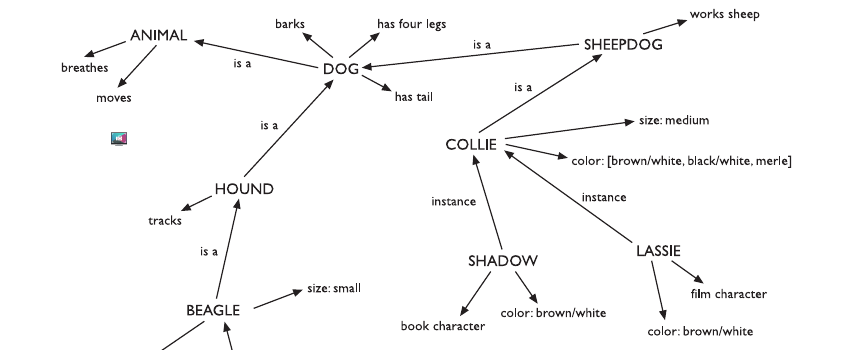

# Model Human Processor
The human being is one of the the main foundation of HCI. In fact, computer systems are the designed to meet the needs of the human being, so it's important to consider capabilities and limitation of the user.

Human being is a complex system so in HCI we represent it using a simplified _model_. 

In 1983, Card, Moran and Newell described the Model Human Processor,
which is a simplified view of the human processing involved in interacting with
computer systems. The model comprises three subsystems: the **perceptual system**,
handling sensory stimulus from the outside world, the **motor system**, which controls
actions, and the **cognitive system**, which provides the processing needed to connect
the two.

<!-- The model also includes a number of *principles of operation* which dictate the behavior of the systems under certain conditions. -->

The are three components of this system: 
1. input–output
2. memory 
3. processing

## Input-output
A person interaction with the outside world  occurs through information being
received and sent: input and output. 
In an interaction with a computer the user receive information by the machine (which is the computer output) and responds providing input to the computer.

We use our senses to perceive information of the world and of ourselves. 
* Vision
* Hearing
* Touch 
* Taste
* Smell
* Proprioception or kinestesia: perception of the position of the body and its part in the space.
* Balance

### Vision 
Most important sense. The visual perception can be split in two stages:
* physical reception of the stimulus from the outside world;
* perception and iterpretation of the stimulus. 

The human eye is formed by the **cornea** and **lens** at the front of the eye focus the light into
a sharp image on the back of the eye, the **retina**. The retina is light sensitive and contains two types of photoreceptor: **rods** and **cones**.

There are fourtypes of photoreceptors:
* Rods(bastoncelli), spread allover the retina, verysensitive to the quantity of light and allowa fairly good night vision. They are not sensitive to colors and are easy to saturate (glare–abbagliamento).
* Cones(coni) are mainly placed in the fovea, and are very sensitive to the colors. They are not activate when the quantity of light is low, hence we have a limited perception of colors at night
* X-Ganglion: mostly in the fovea, are dedicated to the pre-identification of visual patterns
* W-and Y-Ganglion: are everywhere and more densely in the external part of the retina, and are dedicated  to the pre-identificationof movement. This allows to perceive movement at the back of the eye much faster even without recognizing the shapes. 

#### Vision and structure
The human vision is holistic.
Our visual system automatically imposes structure on visual input and is wired to
perceive whole shapes, figures, and objects rather than disconnected edges, lines,
and areas.
These theories
became known as the **Gestalt principles of visual perception**.

**Gestalt principles: Proximity**

The relative distance between objects affects our perception of whether and how the objects are organized into sub-groups. 

*In the image above, the stars are perceive grouped in row and columns*

According to this principle, items can be gruouped by simply reducing the space between them without any visual separation element, which can increase visual clutter. 

*Here poorly spaced radiobuttons look grouped in vertical columns.*

**Gestalt principles: Similarity**

Objects that look similar appear grouped.
<!-- ---------------- -->

**Gestalt principles: Continuity**

Several Gestalt principles describe our visual system’s tendency to resolve ambiguity or fill in missing data in such a way as to perceive whole objects. Coninuity states that our visual perception is biased to perceive continuous forms rather than disconnected ones *(Example: IBM logo)*.

**Gestalt principles: Closure**

This princible is also related to _Continuity_. In fact, clouser states that human visual system automatically closes open figures so that they are perceived as a whole. 

 

 This principles applies to GUIs. For example stacks of objects in a icon make users perceive those stacks as a whole object.

**Gestalt principles: Symmetry**

A third fact about our tendency to see objects is captured in the Gestalt principle of
Symmetry. It states that we tend to parse complex scenes in a way that reduces the
complexity. Our vision automatically organizes and interprets the data so as to simplify it and give it symmetry.

**Gestalt principles: Figure/Ground**

The next Gestalt principle that describes how our visual system structures the data
it receives is Figure/Ground. This principle states that our mind separates the visual
field into the figure (the foreground) and ground (the background). The foreground consists of those elements of a scene that are the object of our primary attention, and
the background is everything else.

**Gestalt principles: Common Fate**

The last principle is the Common fate which unlike the previuos principles concern the movement of objects.
It states that moving objects moving togheter are perceived as grouped. 

### Reading

The perception of text is important to interface design. There are several stages of the reading process:
1. Input of the visual perception of the text
2. The text is decoded with reference to an internal representation of language. 
3. Sintactic and semantic analysis of the text (_which is not relevant to interface design_)

During reading the eye makes burst movements which takes 6% of the total time reading. The remaining 96% is used in fixation periods. 
The complexity of text is proportional to the number of regressions made (the eye goes back in the line).

Empirical proofs have shown that entire words are recoinized as single character, we recognize words using word shape => _it's more difficult to read a capitalized text._

The speed at which text can be read is a measure of its legibility. Experiments have
shown that standard font sizes of 9 to 12 points are equally legible, given proportional spacing between lines. Similarly line lengths of between 6 and 14 cm are equally legible. However, there is evidence that reading
from a computer screen is slower than from a book.

### Hearing 

This sense conveys a lot of information to the brain. The air virbrations are perceived by the hear and trasmists them, through various stages, to the auditory nerves. 

The ear receives air
vibrations that are collected
and aplified by the auricle
(padiglione auricolare)
hitting the eardrum
(timpano) that moves three
little bones: malleus, incus
and stape (martello, incudine e staffa) that move a jelly-like
substance in the cochlea (or inner ear), which activates tiny hair
cells trasmitting information to the auditory nerve and to the brain.

## Memory
As well as storing all our factual knowledge, our memory contains our knowledge of actions or procedures.
The are three type of memory or memory function:
* **Sensory memory**
* **Short-term memory or working memory**
* **Long-term memory**

### Sensory memory
Acts as a buffer for sensorial stimuli. There is one sensory memory for each sensory channel:
* Iconic memory for visual stimuli
* Echoic memory for aural stimuli (used for stereophonic comparison, but
also for retention of the stimulus)
* Tactile memory for touch
* Etc.

In terms of **percistence**, stimulus is maintained for a few tenth of second (about 0.5 sec for vision)
and is continuously rewritten. Only a minimal quantity of data is maintained, most of it is lost
immediately or during data processing.

Information is passed from sensory memory into short-term memory by **attention**, thereby filtering the stimuli to only those which are of interest at a given time.

#### Design
Reduce mental load needed to interpret sensory stimulus. Which can be done using simple, well di well differentiated,solidly placed in the overall interface. 

Use the theory of Gestalt the structuring of the perceipt. Allow for grouping of connected pieces, make differences evident when they are meaningful, hide differences when they are not. 

### Short-term memory
Called also working memory, is used to store data relevant for the tasks currentlyi n execution are maintained and processed.

Short-term memory has a limited capacity. We can remember 7 (+/- 2) chuncks of information (_like 7 groups of digits_).  The
limited capacity of short-term memory produces a subconscious desire to create
chunks, and so optimize the use of the memory. The successful formation of a chunk
is known as closure. 

The short-memory is always full, new chunks remove old ones and the latters are lost. 

Retention is amplified by importance first and freshness second.

#### Design
Reduce the mental load necessary to maintain dialog context and consistency: Have fewer chunks(complex if needed) to retain in mind(7±2 distinct elements).
Help recover disappeared chunks from the visual context.
Help retain greater quantity of information through grouping.

That's not so valid with menus and list, they are not required to be memorized because are always available in the interface.

### Long-term memory

In the long-term memory we store everything we "know". It has relevant differences from short-term memory:
* The size in possibly unbounded
* Slower access time
* Forgetting occurs more slowly

There are two types of long-term memory:
1. **Episodic memory**: represents our memory of events and experiences in a serial form.

2. **Semantic memory**:  structured record
of facts, concepts and skills that we have acquired. 

The information in semantic memory is derived from that in our episodic memory, such that we can learn new facts or concepts from our experiences.

Semantic memory is structured in some way to allow access to information,
representation of relationships between pieces of information, and inference. This is known as _semantic network_.

  

  Our knowledge is organized by association. 

  Disconnected concepts (without logical connections to other facts of our knowledge) are harder to retain than connected ones
  
  Abstract concepts are harder to retain than concrete concepts 
  
  Concepts with a higher level of emotional connection are easier to retain than dry ones
 
##### Loss of information
We can forget things, the are two theories about forgetting:
* **Decay**: memories not access for long time may eventually be forgotten.
* **Interference**: the acquisistion of new information causes the loss of old information (*we replace it*).

It is impossible to prove that we do forget: appearing to have forgotten something may just be caused by not being able to retrieve it. Like in interference we may *replace* information but it's not totally true. 
In fact, *proactive inhibition* occurs when old memory trace breaks through and interferes with new information.

On this lines, information may not be recalled but may be recognized, or
may be recalled only with prompting.

#### Design
* Never rely on plain memory of facts
* Try to convey a narrative in the sequence of steps. Alternatively, iconic or visual memory is better that episodic or punctual memory
* Allow for easy abstraction to allow for simpler chunks to be retained.
* Use verbs for actions and nouns for concepts. Create a narrative for the interaction

## Processing
Reasoning is the process by which we use the knowledge we have to draw conclusions
or infer something new about the domain of interest. There are a number of different types of reasoning: _deductive, inductive and abductive_. 

### Deductiove reasoning
Deductive reasoning derives the logically necessary conclusion from the given premises. But 
Deductive reasoning is therefore often misapplied, the logical conclusion doens't correspond to the truth at all time. 
<!-- da rivedere -->
One explanation for this is that people bring their world knowledge into the reasoning process. There is good reason for this. It allows us to take short cuts which makendialog and interaction between people informative but efficient. 

### Inductive reasoning
Induction is generalizing from cases we have seen to infer information about cases
we have not seen. In spite of its unreliability, induction is a useful process, which we use constantlyin learning about our environment

### Abductive reasoning
The third type of reasoning is abduction. Abduction reasons from a fact to the action
or state that caused it. This is the method we use to derive explanations for the events
we observe. 

> _For example, suppose we know that Sam always drives too fast when she has been drinking. If we see Sam driving too fast we may infer that she has been drinking. This too is unreliable since there may be another reason why sheis driving fast._

In spite of its unreliability, it is clear that people do infer explanations in this way,
and hold onto them until they have evidence to support an alternative theory or
explanation. This can lead to problems in using interactive systems. If an event
always follows an action, the user will infer that the event is caused by the action
unless evidence to the contrary is made available. If, in fact, the event and the action
are unrelated, confusion and even error often result.

## Problem solving
If reasoning is a means of inferring new information from what is already known,
problem solving is the process of finding a solution to an unfamiliar task, using the
knowledge we have.T here are a number of different views of how people
solve problems. 

### Behaviourism
Problem solving is based on either applying existing rules, or by trial and error, exploring possible solutions until a good one is found.

### Gestalt theory
The explanation illustrated by the behaviourism model was insufficient to explain entirelly the human problem-solving behavior.

Problem solving is both **productive** and **reproductive**. Reproductive problem solving draws on previous experience as the behaviorists claimed, but productive problem solving involves insight and restructuring of the problem. 

### Problem space theory
The problem is expressed as the search for a
path inside a space where there is an initial state (the problem) and a final
state (the solution), Possible desirable intermediate places are identified,
and the problem solving is expressed as finding a path to a closer
intermediate place, and then analysis is started again from the closer
position. Each subproblem is analyzed looking for euristics, competencies
and analogies.
